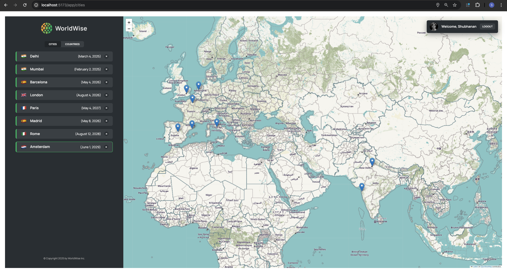

# WorldWise

A modern React application that helps users track and visualize their global travels, built with React, Context API, React Router, and CSS Modules.



## Overview

WorldWise is a feature-rich travel tracking application that allows users to mark cities they've visited on a world map. Users can add new cities, view details about visited locations, and organize their travels by country. The application features a clean, responsive UI with an interactive map.

## Features

- **User Authentication**: Secure login to access personal travel data
- **Interactive Map**: Visualize visited cities on a world map
- **City Management**: Add new cities to your travel history
- **City Details**: View information about each visited location
- **Country Filtering**: Organize and view cities by country
- **Protected Routes**: Secure access to user data
- **Responsive Design**: Optimized for both desktop and mobile devices
- **Performance Optimized**: Uses code splitting and lazy loading

## Project Structure

The project follows a component-based architecture:

```
worldwise/
├── data/              # JSON data files
│   └── cities.json    # Cities data for JSON server
├── public/            # Static assets
├── src/
│   ├── components/    # Reusable UI components
│   │   ├── Button.jsx     # Button component
│   │   ├── CityList.jsx   # List of cities
│   │   ├── CountryList.jsx# List of countries
│   │   ├── City.jsx       # City details component
│   │   ├── Form.jsx       # Add new city form
│   │   ├── Map.jsx        # Interactive Leaflet map
│   │   ├── User.jsx       # User profile component
│   │   └── ...
│   ├── contexts/      # React Context providers
│   │   ├── CitiesContext.jsx  # Cities data management
│   │   └── FakeAuthContext.jsx# Authentication management
│   ├── hooks/         # Custom React hooks
│   ├── pages/         # Page components
│   │   ├── AppLayout.jsx  # Main application layout
│   │   ├── Homepage.jsx   # Landing page
│   │   ├── Login.jsx      # Login page
│   │   └── ...
│   └── App.jsx        # Main application component
└── package.json       # Project dependencies and scripts
```

### Key Components

- **AppLayout**: Main layout wrapper with sidebar, map, and user info
- **CityList**: Displays all cities the user has visited
- **Map**: Interactive map showing visited locations
- **City**: Shows detailed information about a selected city
- **Form**: Interface for adding new cities to the travel history
- **ProtectedRoute**: Higher-order component that secures app routes

## Getting Started

### Prerequisites

- Node.js (v16.0.0 or higher)
- npm or yarn

### Installation

1. Clone the repository:

   ```bash
   git clone https://github.com/shubhs27/WorldWise.git
   cd worldwise
   ```

2. Install dependencies:

   ```bash
   npm install
   # or
   yarn
   ```

3. Start the development server:

   ```bash
   npm run dev
   # or
   yarn dev
   ```

4. Start the JSON server (required for adding and managing cities):

   ```bash
   npm run server
   # or
   yarn server
   ```

   This will start the JSON server watching the `data/cities.json` file on port 8000 with a 500ms delay to simulate real-world API conditions.

5. Open your browser and navigate to `http://localhost:5173` (or the port shown in your terminal)

> **Important**: The JSON server must be running for the application to function properly. All city management features (adding, viewing, and deleting cities) require this backend service.

### Building for Production

```bash
npm run build
# or
yarn build
```

The build output will be placed in the `dist` directory and can be served using the Vite preview command:

```bash
npm run preview
# or
yarn preview
```

> **Note**: For production deployment, you'll need to set up a proper backend server or service to replace the JSON server used during development.

## Technologies Used

- **React**: UI library
- **React Router**: Navigation and routing
- **Context API**: State management
- **CSS Modules**: Component-scoped styling
- **Lazy Loading**: Performance optimization technique
- **Vite**: Build tool and development server

## API Integration

The application communicates with a local REST API:

- API base URL: `http://localhost:8000`
- Endpoints:
  - GET `/cities`: Retrieve all visited cities
  - GET `/cities/:id`: Get details for a specific city
  - POST `/cities`: Add a new city
  - DELETE `/cities/:id`: Remove a city from the history

## Context Structure

The application state is managed through React Context:

- **CitiesContext**: Manages the cities data with the following state:

  - `cities`: Array of all visited cities
  - `currentCity`: Currently selected city details
  - `isLoading`: Loading state indicator
  - `error`: Error state message

- **AuthContext**: Handles user authentication with:
  - `user`: Current user information
  - `isAuthenticated`: Authentication status
  - `login`: Login function
  - `logout`: Logout function

## Authentication

For demonstration purposes, the app uses a fake authentication system with the following credentials:

- Email: shubhanan@example.com
- Password: qwerty

## Performance Optimization

The application utilizes code splitting and lazy loading for improved performance:

- Main pages are lazy-loaded using React's `lazy` and `Suspense`
- The bundle size is significantly reduced (from ~508KB to ~350KB)

## Future Enhancements

- Implement persistent storage with a real backend
- Add user registration functionality
- Enable note-taking for each city
- Add date tracking for visits
- Support for uploading travel photos
- Trip planning features
- Social sharing capabilities

## Acknowledgments

- This project is part of Jonas Schmedtmann's Udemy course - The Ultimate React Course 2025
- All assets and UI components are inspired by the course material.

# WorldWise - Travel Adventure Tracker

A modern React application that helps users track and visualize their global travels, built with React, Context API, React Router, and CSS Modules.


## Overview

WorldWise is a feature-rich travel tracking application that allows users to mark cities they've visited on a world map. Users can add new cities, view details about visited locations, and organize their travels by country. The application features a clean, responsive UI with an interactive map.

## Features

- **User Authentication**: Secure login to access personal travel data
- **Interactive Map**: Visualize visited cities on a world map
- **City Management**: Add new cities to your travel history
- **City Details**: View information about each visited location
- **Country Filtering**: Organize and view cities by country
- **Protected Routes**: Secure access to user data
- **Responsive Design**: Optimized for both desktop and mobile devices
- **Performance Optimized**: Uses code splitting and lazy loading

## Project Structure

The project follows a component-based architecture:

```
worldwise/
├── data/              # JSON data files
│   └── cities.json    # Cities data for JSON server
├── public/            # Static assets
├── src/
│   ├── components/    # Reusable UI components
│   │   ├── Button.jsx     # Button component
│   │   ├── CityList.jsx   # List of cities
│   │   ├── CountryList.jsx# List of countries
│   │   ├── City.jsx       # City details component
│   │   ├── Form.jsx       # Add new city form
│   │   ├── Map.jsx        # Interactive Leaflet map
│   │   ├── User.jsx       # User profile component
│   │   └── ...
│   ├── contexts/      # React Context providers
│   │   ├── CitiesContext.jsx  # Cities data management
│   │   └── FakeAuthContext.jsx# Authentication management
│   ├── hooks/         # Custom React hooks
│   ├── pages/         # Page components
│   │   ├── AppLayout.jsx  # Main application layout
│   │   ├── Homepage.jsx   # Landing page
│   │   ├── Login.jsx      # Login page
│   │   └── ...
│   └── App.jsx        # Main application component
└── package.json       # Project dependencies and scripts
```

### Key Components

- **AppLayout**: Main layout wrapper with sidebar, map, and user info
- **CityList**: Displays all cities the user has visited
- **Map**: Interactive map showing visited locations
- **City**: Shows detailed information about a selected city
- **Form**: Interface for adding new cities to the travel history
- **ProtectedRoute**: Higher-order component that secures app routes

## Getting Started

### Prerequisites

- Node.js (v14.0.0 or higher)
- npm or yarn

### Installation

1. Clone the repository:

   ```bash
   git clone https://github.com/yourusername/worldwise.git
   cd worldwise
   ```

2. Install dependencies:

   ```bash
   npm install
   # or
   yarn
   ```

3. Start the development server:
   ```bash
   npm run dev
   # or
   yarn dev
   ```

## Technologies Used

- **React 18**: UI library
- **React Router v6**: Navigation and routing
- **Context API**: State management
- **CSS Modules**: Component-scoped styling
- **Lazy Loading**: Performance optimization technique
- **Vite**: Build tool and development server
- **Leaflet/React-Leaflet**: Interactive mapping library
- **React-DatePicker**: Date selection component
- **JSON Server**: Mock REST API for development

## API Integration

The application communicates with a local REST API:

- API base URL: `http://localhost:8000`
- Endpoints:
  - GET `/cities`: Retrieve all visited cities
  - GET `/cities/:id`: Get details for a specific city
  - POST `/cities`: Add a new city
  - DELETE `/cities/:id`: Remove a city from the history

## Context Structure

The application state is managed through React Context:

- **CitiesContext**: Manages the cities data with the following state:

  - `cities`: Array of all visited cities
  - `currentCity`: Currently selected city details
  - `isLoading`: Loading state indicator
  - `error`: Error state message

- **AuthContext**: Handles user authentication with:
  - `user`: Current user information
  - `isAuthenticated`: Authentication status
  - `login`: Login function
  - `logout`: Logout function

## Authentication

For demonstration purposes, the app uses a fake authentication system with the following credentials:

- Email: shubhanan@example.com
- Password: qwerty

## Performance Optimization

The application implements code splitting and lazy loading for improved performance:

```javascript
// Before optimization
// dist/assets/index-93df4c8c.css   30.25 kB │ gzip:   5.05 kB
// dist/assets/index-df0d5e63.js   508.68 kB │ gzip: 148.02 kB

// After optimization
// dist/assets/index-71b70b85.js   350.17 kB │ gzip: 101.39 kB
```

Key pages are lazy-loaded:

- Homepage
- Product
- Pricing
- Login
- AppLayout
- PageNotFound

## Future Enhancements

- Implement persistent storage with a real backend
- Add user registration functionality
- Enable note-taking for each city
- Add date tracking for visits
- Support for uploading travel photos
- Trip planning features
- Social sharing capabilities

## 🙏 Acknowledgments

- This project was created as a practice application for learning React and related technologies
- UI design inspired by modern travel applications

---

Happy Traveling with WorldWise! 🌍✈️
